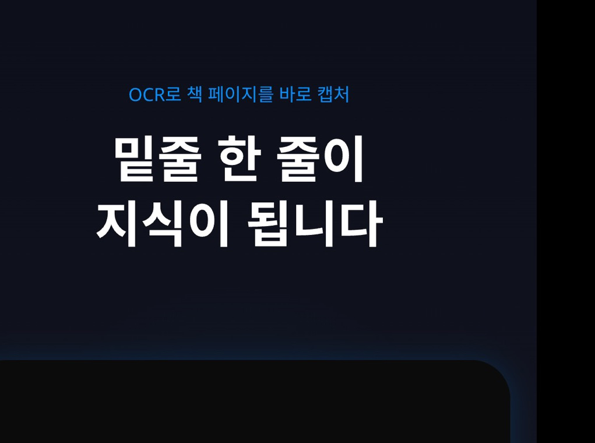
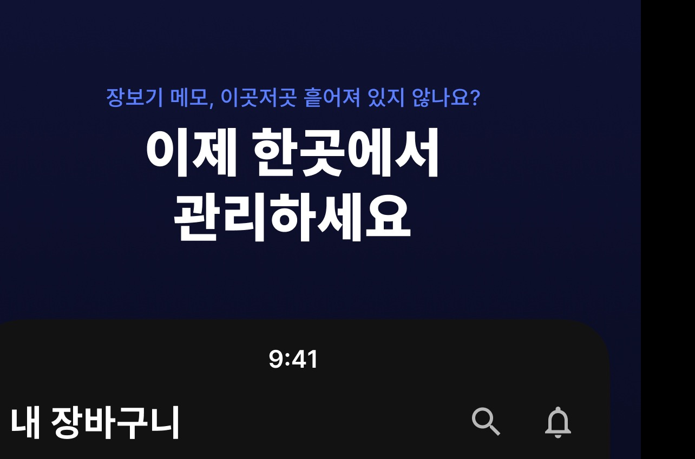

# 제품 주도 개발을 지향하는 프론트엔드 개발자

Vue · React · Next.js · TypeScript · Flutter로 사용자 문제를 실제 제품으로 만듭니다.

## 🌍 Contributions

- [TanStack Query #10182](https://github.com/TanStack/query/pull/10182) — ESLint v10 peer dependency 호환성 개선
- [TanStack Query #10465](https://github.com/TanStack/query/pull/10465) — Vue Query `queryOptions.enabled` 타입 회귀 수정
- [toss/react-simplikit #370](https://github.com/toss/react-simplikit/pull/370) — React 유틸리티 라이브러리 개선 기여

[opengiver](https://github.com/opengiver) · [opengiver-skills](https://github.com/byungsker/opengiver-skills)

## 🧩 Products

<table>
  <tr>
    <td valign="top" width="50%">
      
       
      <b><a href="https://byungskerlog.com/products/bookgolas">북골라스</a></b>
       
      독서 목표·기록·통계와 AI Recall·인사이트를 제공하는 독서 앱
    </td>
    <td valign="top" width="50%">
      
       
      <b><a href="https://byungskerlog.com/products/baroguni">바로구니</a></b>
       
      개인·가족·친구가 함께 쓰는 AI 장바구니 · 패턴 분석·지출 통계·추천 칩·최저가 비교
    </td>
  </tr>
</table>

<table>
  <tr>
    <td valign="top" width="50%">
      <h3>🎤 발표</h3>
      <ul>
        <li><a href="https://byungskerlog.com/posts/teoconf2024-%EC%8A%A4%ED%94%BC%EC%BB%A4-%ED%9B%84%EA%B8%B0-bloj8ivk">TeoConf2024 발표</a> 주니어 개발자의 200일 글쓰기 챌린지</li>
        <li><a href="https://byungskerlog.com/posts/%EA%B8%80%EB%98%90-%ED%94%84%EB%A1%A0%ED%8A%B8%EC%97%94%EB%93%9C-%EB%AA%A8%EB%B0%94%EC%9D%BC-%EB%B0%98%EC%83%81%ED%9A%8C-%EB%B0%9C%ED%91%9C-%ED%9B%84%EA%B8%B0">글또 프론트엔드 모바일 반상회</a> 첫 npm 라이브러리 배포 경험 공유</li>
      </ul>
    </td>
    <td valign="top" width="50%">
      <h3>✏️ 최근 포스트</h3>
      <ul>
        <li><a href="https://byungskerlog.com/posts/7%EC%9D%B8%EC%9D%98-ai-%EB%93%9C%EB%A6%BC%ED%8C%80-%EB%A7%8C%EB%93%A4%EA%B8%B0-%EB%A6%AC%EB%B7%B0">7인의 AI 드림팀 만들기 리뷰</a></li>
        <li><a href="https://byungskerlog.com/posts/ai%EA%B0%80-%EB%91%90%EB%A0%A4%EC%9A%B4-%EB%8B%B9%EC%8B%A0%EC%97%90%EA%B2%8C-%EB%A6%AC%EB%B7%B0">AI가 두려운 당신에게 리뷰</a></li>
        <li><a href="https://byungskerlog.com/posts/tanstack-query-%EC%B2%AB-%EA%B8%B0%EC%97%AC-feat-eslint-v10-peerdependency-issue">TanStack Query 첫 기여</a></li>
      </ul>
      <a href="https://byungskerlog.com/posts">더 많은 글 보기</a>
    </td>
  </tr>
</table>

<table>
  <tr>
    <td valign="top" width="60%">
      <b>✨ Tech Stack</b> 
      
      
      
      
      
    </td>
    <td valign="top" width="40%">
      <b>📫 Channels</b> 
      
      
      
    </td>
  </tr>
</table>
